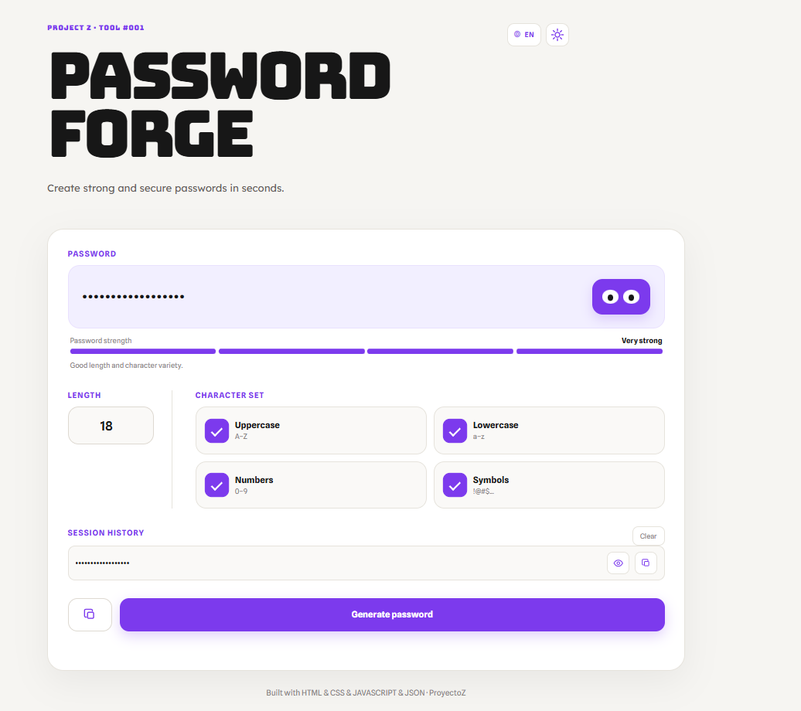

# 🔐 Password Forge

Password Forge is a lightweight, responsive password generator built with **HTML5, CSS3, and vanilla JavaScript**.

The application generates configurable random passwords directly in the browser, provides client-side strength estimation, supports password visibility and clipboard operations, includes a session-only password history, and offers a multilingual interface with automatic language detection.

Password Forge is the first major project developed as part of **ProyectoZ**, a personal learning initiative focused on building, testing, documenting, deploying, and iteratively improving real software.

---

## ✨ Features

- 🔑 Cryptographically stronger random password generation using the **Web Crypto API**
- 📏 Configurable password length from **4 to 64 characters**
- 🔠 Uppercase character support
- 🔡 Lowercase character support
- 🔢 Numeric character support
- 🔣 Symbol support
- ✅ Guarantees at least one character from every selected character category
- 🔀 Shuffles generated characters before displaying the final password
- 👁️ Show/hide password functionality
- 📋 Clipboard integration for copying generated passwords
- 📊 Client-side password strength estimation
- 💡 Security recommendations based on password characteristics
- 🕘 Session-only password history
- 👁️ Individual visibility controls for history entries
- 📋 Individual copy controls for history entries
- 🧹 History clearing
- 🌍 Automatic browser language detection
- 🌐 Manual language selection
- 💾 Persistent language preference
- 🌙 Persistent light/dark theme
- ☀️ Custom animated sun/moon theme control
- 📱 Responsive layout for desktop and mobile
- ♿ Keyboard focus states and accessible labels
- 🎬 CSS micro-interactions and transitions
- 🧠 Persistent password-generation preferences
- 🚫 No server-side password storage

---

## 🧩 Architecture

Password Forge is intentionally implemented as a client-side application without a frontend framework or backend.

The application is divided into three primary layers:

```text
┌───────────────────────────────┐
│            HTML5              │
│   Semantic structure & UI     │
└───────────────┬───────────────┘
                │
                ▼
┌───────────────────────────────┐
│             CSS3              │
│ Layout · Responsive UI        │
│ Themes · Animations           │
└───────────────┬───────────────┘
                │
                ▼
┌───────────────────────────────┐
│          JavaScript           │
│ Generation · State · UI logic │
│ i18n · Clipboard · History    │
└───────────────┬───────────────┘
                │
         ┌──────┴──────┐
         ▼             ▼
   Web Crypto API   Fetch API
         │             │
         ▼             ▼
   Random values   Translation JSON
```

No build step, bundler, package manager, or external JavaScript dependency is required.

---

## 🔐 Password Generation

Password generation is performed entirely in the browser.

The application uses:

```javascript
crypto.getRandomValues()
```

to obtain cryptographically stronger random values instead of relying on `Math.random()` for password generation.

### Character selection

The user can independently enable:

```text
Uppercase
Lowercase
Numbers
Symbols
```

Before filling the remaining positions, the generator inserts at least one character from each selected category.

For example, when all four categories are enabled, the generated password is guaranteed to contain:

```text
At least 1 uppercase character
At least 1 lowercase character
At least 1 number
At least 1 symbol
```

The complete result is then shuffled so that required characters are not kept in deterministic positions.

### Random index selection

The random character selection uses rejection sampling when selecting an index. This avoids the simple modulo approach introducing distribution bias when the random integer range is not evenly divisible by the size of the selected character set.

---

## 📊 Password Strength Estimation

Password Forge includes a lightweight client-side heuristic for estimating password strength.

The estimator considers characteristics including:

- Password length
- Uppercase character presence
- Lowercase character presence
- Numeric character presence
- Symbol presence
- Repeated character patterns
- Simple sequential patterns

The UI exposes four visual strength segments and the following labels:

```text
Very weak
Weak
Medium
Strong
Very strong
```

The estimator is intended as a **UX-oriented guideline**, not as a complete password-auditing engine or a guarantee of security.

---

## 🌍 Internationalization

Password Forge uses external JSON translation files instead of embedding all translations inside `script.js`.

Supported languages:

```text
English
Spanish
French
German
Italian
```

Translation files are stored in:

```text
translations/
├── de.json
├── en.json
├── es.json
├── fr.json
└── it.json
```

### Automatic language detection

The application checks the browser's preferred languages through:

```javascript
navigator.languages
```

It then extracts the base language code.

For example:

```text
es-ES → es
en-US → en
fr-FR → fr
de-DE → de
it-IT → it
```

If the detected language is not supported, the application falls back to English.

### Manual language selection

Users can override automatic detection through the language selector.

The selected language is stored in:

```javascript
localStorage
```

and restored on subsequent visits.

---

## 🌙 Theme System

Password Forge includes persistent light and dark themes.

The theme is represented using:

```html
<html data-theme="light">
```

or:

```html
<html data-theme="dark">
```

CSS variables are used to adapt the interface without maintaining two separate stylesheets.

When no manual theme preference exists, the application also checks the operating system/browser preference through:

```text
prefers-color-scheme: dark
```

The selected theme is stored locally and restored on subsequent visits.

---

## 🕘 Session History

Password Forge maintains a history of the most recently generated passwords during the current browser session.

The history:

- Stores up to five passwords
- Displays passwords masked by default
- Allows individual show/hide operations
- Allows individual copy operations
- Can be cleared manually

### Privacy decision

The password history is deliberately **not stored in `localStorage`**.

Only non-sensitive application preferences such as:

```text
Language
Theme
Password length
Character selection
```

are persisted.

This prevents generated passwords from being retained between sessions by the application.

---

## 📋 Clipboard

The application uses the browser Clipboard API:

```javascript
navigator.clipboard.writeText()
```

Clipboard functionality is available both for the current generated password and for individual session-history entries.

---

## ♿ Accessibility

The project includes several accessibility-oriented practices:

- Semantic HTML structure
- Explicit button types
- Accessible labels
- `aria-label` attributes for icon-only controls
- `aria-live` regions for dynamic content
- `aria-pressed` state for password visibility
- Visible keyboard focus states
- Reduced-motion support through:

```css
@media (prefers-reduced-motion: reduce)
```

Accessibility remains an area for further testing and improvement.

---

## 🎨 UI / UX

Password Forge uses a custom visual system built around:

### Typography

- **Bungee** — primary title and project eyebrow
- **Lexend Deca** — subtitle and generated password
- **Spline Sans** — general interface text

### Visual language

- Soft neutral background
- Purple primary accent
- Rounded cards and controls
- Responsive CSS Grid
- Animated state transitions
- Custom password visibility control
- Custom animated sun/moon theme control
- Light and dark theme variants

The design goal is to keep the interface visually distinctive while maintaining a relatively small and dependency-free codebase.

---

## 🛠️ Technologies

| Technology | Purpose |
|---|---|
| **HTML5** | Semantic application structure |
| **CSS3** | Layout, theming, responsive design and animations |
| **JavaScript (ES6+)** | Application logic and state management |
| **Web Crypto API** | Random password generation |
| **Clipboard API** | Password copying |
| **Fetch API** | Loading translation resources |
| **JSON** | External translation data |
| **LocalStorage** | Persisting non-sensitive preferences |
| **Git** | Version control |
| **GitHub** | Source-code hosting |
| **GitHub Pages** | Static deployment |

---

## 📁 Project Structure

```text
PasswordForge/
│
├── index.html
├── style.css
├── script.js
├── icono.png
├── interface.png
├── README.md
│
└── translations/
    ├── de.json
    ├── en.json
    ├── es.json
    ├── fr.json
    └── it.json
```

---

## 🚀 Getting Started

Password Forge requires no package installation or build process.

### Clone the repository

```bash
git clone https://github.com/adrianrrdev/PasswordForge.git
```

### Enter the project directory

```bash
cd PasswordForge
```

### Run locally

Because the application loads translation files through the Fetch API, it should preferably be served through a local HTTP server instead of being opened directly with `file://`.

For example, using Visual Studio Code with a local development server:

```text
VS Code
   ↓
Local HTTP server
   ↓
http://localhost:...
   ↓
Password Forge
```

---

## 🌍 Live Demo

The application is deployed through GitHub Pages:

**https://adrianrrdev.github.io/PasswordForge/**

---

## 📸 Screenshot

### Main Interface



---

## 🧪 Testing

Password Forge has been manually tested during development across its main user flows.

Recommended regression tests include:

```text
✓ Generate a password
✓ Change password length
✓ Toggle uppercase
✓ Toggle lowercase
✓ Toggle numbers
✓ Toggle symbols
✓ Disable all categories
✓ Generate passwords repeatedly
✓ Show/hide current password
✓ Copy current password
✓ Generate multiple passwords
✓ Show/hide history passwords
✓ Copy history passwords
✓ Clear session history
✓ Change language
✓ Reload and verify language persistence
✓ Test unsupported browser language fallback
✓ Switch light/dark mode
✓ Reload and verify theme persistence
✓ Test responsive layouts
```

---

## 📚 What I Learned

Building Password Forge was an opportunity to move from isolated programming exercises to a complete frontend application.

The project introduced and reinforced:

- HTML structure and semantic markup
- CSS Grid and responsive layouts
- CSS variables
- Typography systems
- UI state styling
- CSS transitions and animations
- JavaScript functions and variables
- DOM manipulation
- Input validation
- Regular expressions
- Web Crypto API
- Clipboard API
- Fetch API
- JSON
- Asynchronous JavaScript
- LocalStorage
- Internationalization
- Client-side state management
- Accessibility fundamentals
- Git and GitHub workflows
- GitHub Pages deployment
- Technical documentation

More importantly, the project provided experience with the complete development lifecycle:

```text
Idea
 ↓
Design
 ↓
Implementation
 ↓
Testing
 ↓
Debugging
 ↓
Refactoring
 ↓
Documentation
 ↓
Version Control
 ↓
Deployment
```

---

## 🔮 Future Improvements

Possible future improvements include:

- [ ] Replace the heuristic strength estimator with a more sophisticated analysis model
- [ ] Add automated unit and integration tests
- [ ] Add more comprehensive accessibility testing
- [ ] Add additional translation languages
- [ ] Improve error handling and user feedback
- [ ] Add a configurable symbol set
- [ ] Add a dedicated landing page
- [ ] Add an offline-first translation strategy
- [ ] Improve modularity and separation of concerns
- [ ] Package the project as a reusable frontend template
- [ ] Add Progressive Web App (PWA) support

---

## 🎮 ProyectoZ

Password Forge is the first major project of **ProyectoZ**, a personal year-long challenge focused on practical software development.

ProyectoZ is based on a simple development loop:

> **Build. Test. Improve. Document. Publish.**

Each project is intended to introduce new concepts while producing something concrete that can become part of a professional portfolio.

Password Forge represents the first step from classroom exercises toward independently building and shipping a complete web application.

---

## 👨‍💻 Author

Built by **[adrianrrdev](https://github.com/adrianrrdev)** as part of **ProyectoZ**.

---

⭐ **Explore the repository, try the live demo, and follow the evolution of ProyectoZ.**
